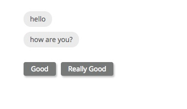

# BotUI

[](https://gitter.im/BotUIChat/botui?utm_source=badge&utm_medium=badge&utm_campaign=pr-badge&utm_content=badge) [](https://www.npmjs.com/package/botui) [](https://www.npmjs.com/package/botui)

> A JavaScript framework to create conversational UIs.


[Main Site](https://botui.org) - [Read Docs](https://docs.botui.org) - [Examples](https://github.com/moinism/botui-examples)

### Quick look



```html
<div class="botui-app-container" id="botui-app">
  <bot-ui></bot-ui>
</div>
```

```javascript
var botui = new BotUI('botui-app'); // give it the id of container

botui.message.bot({ // show first message
  delay: 200,
  content: 'hello'
}).then(function () {
  return botui.message.bot({ // second one
    delay: 1000, // wait 1 sec.
    content: 'how are you?'
  });
}).then(function () {
  return botui.action.button({ // let user do something
    delay: 1000,
    action: [
      {
        text: 'Good',
        value: 'good'
      },
      {
        text: 'Really Good',
        value: 'really_good'
      }
    ]
  });
}).then(function (res) {
  return botui.message.bot({
    delay: 1000,
    content: 'You are feeling ' + res.text + '!'
  });
});
```


### License

[MIT License](https://github.com/moinism/botui/blob/master/LICENSE) - Copyrights (c) 2017 - Moin Uddin
